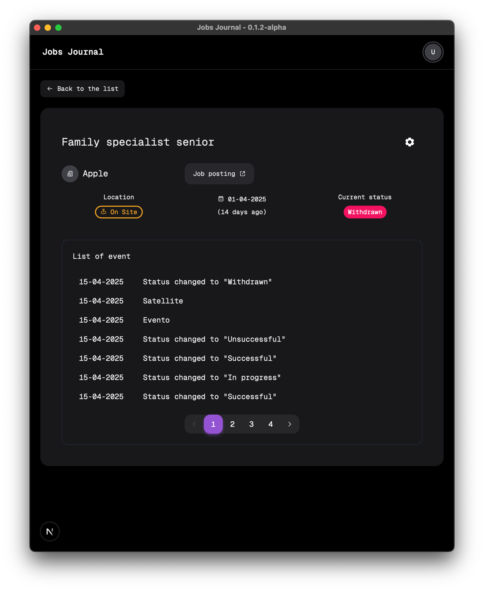

# Jobs Journal


A simple and efficient job journal app to help you track and manage your job search process. Built with Next.js (app routing), Tauri v2, HeroUI, Rust, and SQLite.

## 📊 Project Status

| Badge            | Status |
|:-----------------|:--------|
|  | **Build status currently unavailable** (CI under investigation) |
|  | Latest pre-release tag |
|  | Open issues count |
|  | Open PRs count |
|  | MIT |
|  | Backend |
|  | Frontend |

## Current Status

This is an **alpha version** of the app. It currently offers basic functionality for managing job journal entries — see the [Features](#features) section for more details. Additional features such as tagging, filtering, and enhanced tracking options will be added in due course.

We’re committed to releasing this project as open source and welcome contributions. If you’d like to help or suggest improvements, feel free to [open an issue](https://github.com/rossanoguenci/jobs-journal/issues) or submit a [pull request](https://github.com/rossanoguenci/jobs-journal/pulls).

## Features

- Track job applications and interviews
- Add, edit, and delete (or hide) job entries
- Update job status
- Each job entry has its own event list
- Support for dark and light mode


## Tech Stack

- **Frontend**: Next.js (app routing), HeroUI (React UI library)
- **Backend**: Rust, SQLite, Tauri v2
- **Package Management**: pnpm

## Preview





## Installation

### Prerequisites

- [Node.js](https://nodejs.org/) (v23 or above)
- [Rust](https://www.rust-lang.org/)
- [pnpm](https://pnpm.io/)

### Steps

1. Clone the repository:

    ```bash
    git clone https://github.com/rossanoguenci/jobs-journal.git
    cd jobs-journal
    ```

2. Install the frontend dependencies:

    ```bash
    pnpm install
    ```

3. Install the Tauri dependencies for the backend:

    ```bash
    cd src-tauri
    cargo install
    ```

4. Run the app in development mode:

    ```bash
    pnpm dev
    ```
   
5. To build the app:

   ```bash
   pnpm build
   ```

## Project Structure

- `src/`: Frontend code using Next.js (App Router)
- `src/components/`: Reusable UI components
- `src/config/`: Shared configuration data
- `src/hooks/`: Custom React hooks for handling backend data
- `src/styles/`: Global stylesheets
- `src/types/`: Types automatically generated from Rust structs in Tauri
- `src-tauri/`: Backend code for the Tauri app (Rust)
- `src-tauri-dev-tools/`: Backend tools and DB storage for development
- `scripts/`: Command-line scripts
- `public/`: Static assets such as images and icons
- `utils/`: Reusable helper functions for common tasks


## Contributing

We love to publish this project as open-source, and any contributions are most welcome! If you find any bugs, have suggestions, or want to improve the project, feel free to open an issue or create a pull request.

## License

This project is licensed under the MIT License - see the [LICENSE](LICENSE.txt) file for details.
